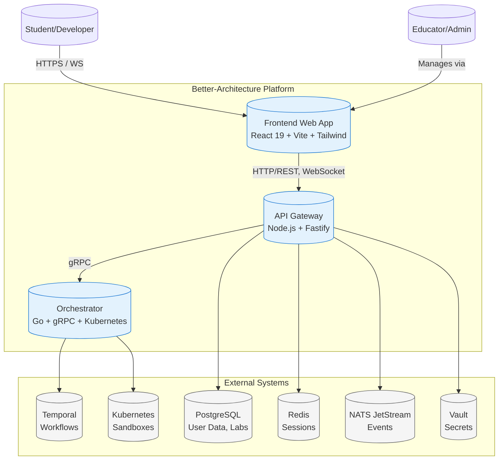
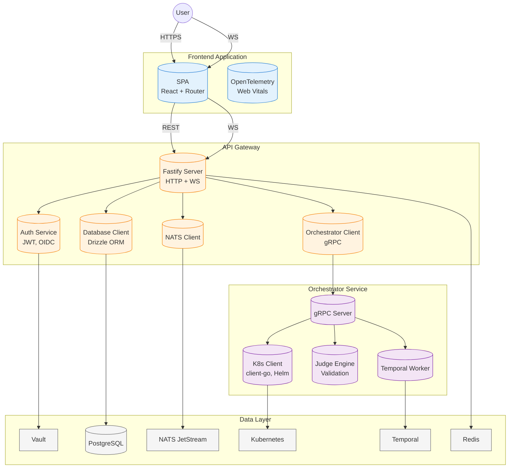
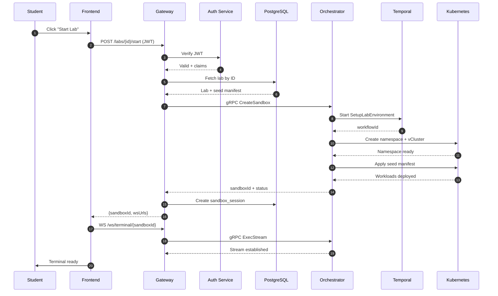
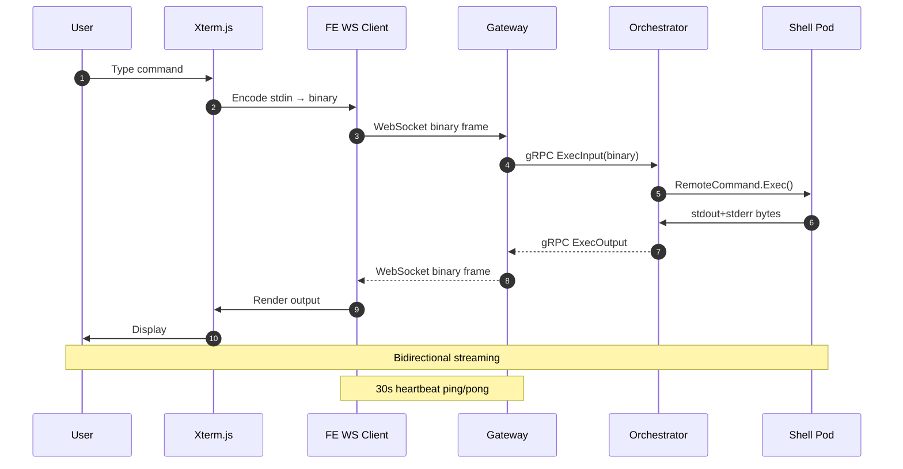
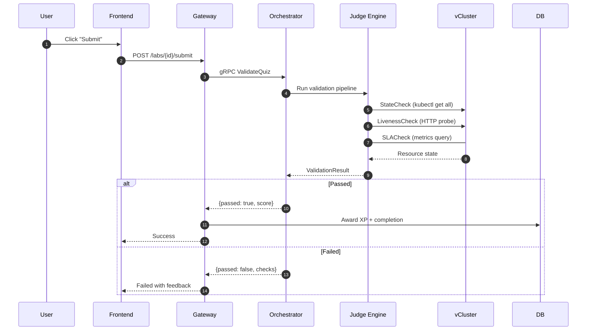
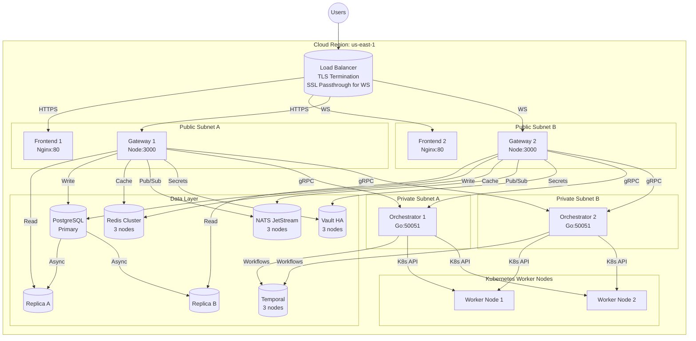
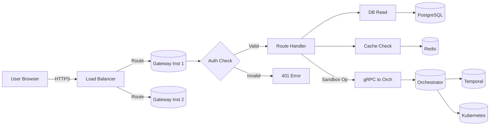
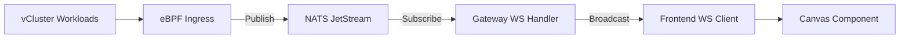

# System Architecture

This document provides comprehensive architecture diagrams for the Better-Architecture educational platform.

## 1. System Context Diagram

## 2. Container/Component Diagram

## 3. Sequence Diagrams

### 3.1 Lab Session Creation Flow

### 3.2 Terminal WebSocket Flow

### 3.3 Lab Validation Flow

## 4. Deployment Diagram

## 5. Data Flow Diagrams

### 5.1 User Request Flow

### 5.2 Real-time Traffic Visualization Flow

---

## Appendix: Technology Stack Reference

| Layer | Technology | Purpose |
|-------|------------|---------|
| **Frontend** | React 19, Vite, Tailwind | UI rendering, routing |
| **Gateway** | Fastify, TypeScript | REST API, WebSocket |
| **Orchestrator** | Go, gRPC, client-go | Sandbox provisioning |
| **Database** | PostgreSQL 16 | Persistent data |
| **Cache** | Redis 7 | Sessions, rate limiting |
| **Messaging** | NATS JetStream | Event streaming |
| **Workflows** | Temporal | Async orchestration |
| **Secrets** | Vault | Key management |
| **Orchestration** | Kubernetes, vCluster | Container runtime |